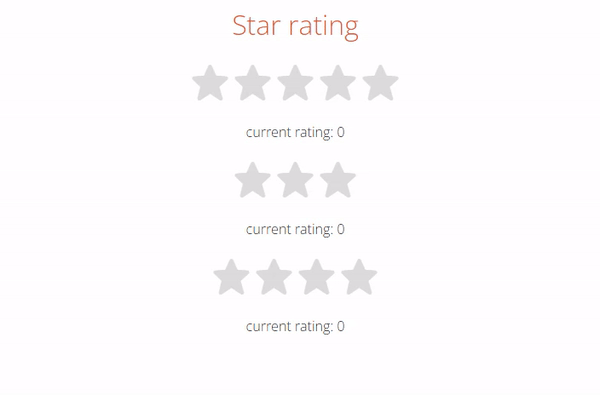

# 📡 js-star-rating

## 💁‍♂️ Introducing Project

> -   별점 모듈 생성
> -   드래그 하면 연회색 표기
> -   클릭하면 노랑색 표기
> -   모듈화하여 어디에도 가져다 쓰기 쉬움

## 🛠 Using Skill

> -   HTML5
> -   CSS3
> -   JavaScript

## 👓 Screen

  

